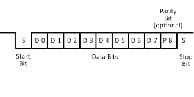

# Serialização  

## Protocolo UART



O protocolo UART é iniciado com a transmissão do start bit com valor 0. Logo após vem o payload, cujo tamanho é 8 bits no total (D0-D7). Em seguida, é transmitido o bit de paridade, responsável por indicar a paridade do payload enviado, para que depois se possa checar com a real paridade do payload recebido. Caso exista imcompatibilidade, o pacote é descartado. O stop bit é o ultímo bit do pacote, responsável por indicar o fim do pacote.

## Descrição do código

### TX 
```cpp
void sw_uart_write_data(due_sw_uart *uart, char* bufferData, int writeN) {
  for(int i = 0; i < writeN; i++) {
    sw_uart_write_byte(uart, bufferData[i]);
  }
}
```
Função responsável por enviar o pacote.

---

```cpp
int calc_even_parity(char data) {
  int Sum = 0;
  for(int i = 0; i <= 7; i++){
    Sum += data >> i & 0x01;
  }
  int paridade = Sum % 2;
  if (paridade == 0){
   return 1;
  }
  return 0;
}
```
Função responsável por calcular a paridade do payload a ser enviado. A funcão recebe o payload e, para cada bit do payload recebido, faz um shift para a esquerda junto com uma operação _and_ e soma com os bits anteriores.

---

```cpp
digitalWrite(uart->pin_tx, LOW);
_sw_uart_wait_T(uart);
```
Envia no pino _TX_ o start bit com valor 0 (_LOW_).

---

```cpp
  for(int i = 0; i < uart->databits; i++) {
    int var = data >> i & 0x01;
    digitalWrite(uart->pin_tx, var);
    _sw_uart_wait_T(uart);
  }
```
Envia no pino _TX_ cada bit do payload de cada vez, por isso o digital._Write_() se encontra dentro de um "for". 

---

```cpp
  if(uart->paritybit != SW_UART_NO_PARITY) {
    digitalWrite(uart -> pin_tx, parity);
    _sw_uart_wait_T(uart);
  }
```
Envia no pino _TX_ o bit de paridade se existir algum tipo de paridade na comunicação. 

---

```cpp
for(int i = 0; i < uart->stopbits; i++) {
       digitalWrite(uart->pin_tx, HIGH);
       _sw_uart_wait_T(uart);
  }
}
```
Envia no pino _TX_ o stop bit com valor 0 (_HIGH_). 

### RX


```cpp
int calc_even_parity(char data) {
  int Sum = 0;
  for(int i = 0; i <= 7; i++){
    Sum += data >> i & 0x01;
  }
  int paridade = Sum % 2;
  if (paridade == 0){
   return 1;
  }
  return 0;
}
```
Função responsável por calcular a paridade do payload a ser enviado. A funcão recebe o payload e, para cada bit do payload recebido, faz um shift para a esquerda junto com uma operação _and_ e soma com os bits anteriores.

---

```cpp
  bool startBitFound = false;
  while (!startBitFound) {
    // read the incoming byte:
    incomingBits = digitalRead(uart->pin_rx);
    if (incomingBits == 0) {
      _sw_uart_wait_half_T(uart);
      if (digitalRead(uart->pin_rx) == 0){
        // confirma start BIT
        startBitFound = true;
      }
    }
  }
}
```
Espera o start bit no pino _RX_ e faz uma dupla verificação para confirmar se esse bit tem valor 0. 

---

```cpp
  for (int i = 0; i <= 7; i++) {
    nchar = nchar | digitalRead(uart->pin_rx) >> i ;
    _sw_uart_wait_half_T(uart);
  } 
```
Recebe o payload e para cada bit, é feito um shift para esquerda junto com uma operação _or_ para recuperar o payload. Depois,  

---

```cpp
  rx_parity = digitalRead(uart->pin_rx);
  _sw_uart_wait_half_T(uart);
```
Recebe o bit de paridade.  

 ---

```cpp
  stopbit = digitalRead(uart->pin_rx);
```
Recebe o stop bit.  

---

```cpp
  parity = calc_even_parity(nchar);
  if(parity != rx_parity) {
    return SW_UART_ERROR_PARITY;
  } 
  
  *data = nchar;
  return SW_UART_SUCCESS;
} 
```
Checa a paridade do payload e compara com a paridade descrita pelo bit de paridade.  
 
 
 


